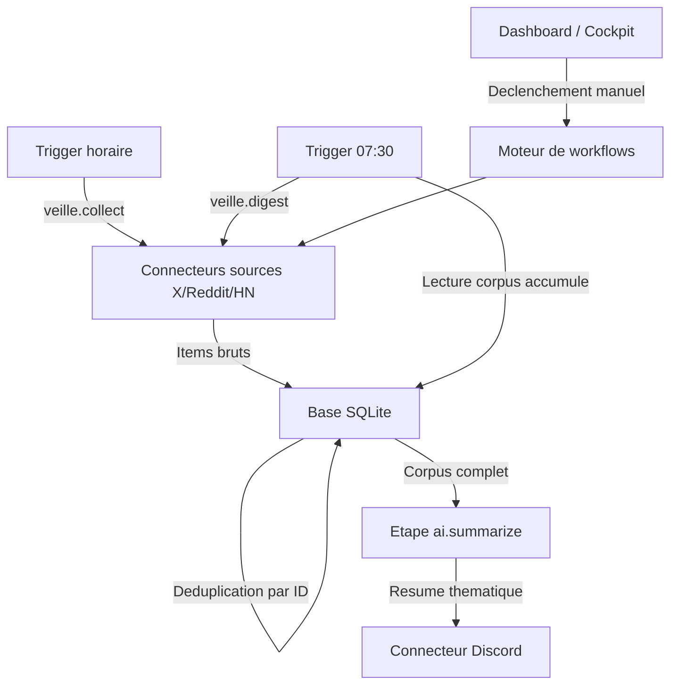
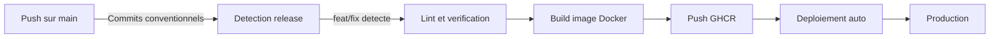

# Solopilot

> Le systeme d'exploitation autonome de l'entreprise d'une personne.

Solopilot est le back-office unique de l'auto-entrepreneur : veille, acquisition, CRM, facturation, comptabilite et agenda, orchestres par des **workflows** pilotes par IA. On decrit son entreprise une fois, et la plateforme fait tourner le quotidien administratif, condense dans un brief matinal unique.

> **Etat actuel** — Solopilot evolue depuis « X AI Weekly Bot ». Le module de **veille** (collecte X/Reddit/HN + resume IA quotidien sur Discord) est en production. Les modules Cockpit, Facturation, Comptabilite, CRM et Agenda sont planifies. Voir la [vision](docs/vision.md), le [plan de migration](docs/migration-plan.md) et le [plan de reimplementation](docs/reimplementation-plan.md).

## Table des matieres

- [Vision et feuille de route](#vision-et-feuille-de-route)
- [Fonctionnalites](#fonctionnalites)
- [Comment ca fonctionne](#comment-ca-fonctionne)
- [Environnements](#environnements)
- [Configuration](#configuration)
- [Developpement local](#developpement-local)
- [Deploiement](#deploiement)
- [Stack technique](#stack-technique)
- [Documentation complementaire](#documentation-complementaire)

### Documentation produit & architecture

| Document | Description |
|----------|-------------|
| [Vision](docs/vision.md) | Ce que devient Solopilot et pourquoi |
| [Plan de migration](docs/migration-plan.md) | Bot → Solopilot, phase par phase |
| [Plan de reimplementation](docs/reimplementation-plan.md) | Architecture workflow, interfaces, modules |
| [Catalogue des workflows](docs/workflows/catalog.md) | Tous les workflows cibles par module |
| [ADR-0013 : Plateforme workflow](docs/adr/0013-from-bot-to-solopilot-workflow-platform.md) | Decision : du bot a la plateforme de workflows |

### Documentation technique

| Document | Description |
|----------|-------------|
| [Reference API](docs/api-reference.md) | Endpoints REST du serveur backend |
| [Integration Discord](docs/discord-integration.md) | Configuration et utilisation des notifications Discord |
| [ADR-0001 : Collecte horaire](docs/adr/0001-hourly-collect-daily-publish-architecture.md) | Separation collecte horaire et publication quotidienne |

## Vision et feuille de route

Solopilot generalise le pipeline « collecter puis publier » du bot en un **moteur de workflows** : chaque processus metier (relancer une facture, preparer la declaration URSSAF, scanner les signaux d'achat, produire le brief du matin) est un workflow declaratif avec un declencheur, des etapes typees et un historique d'executions.

| Module | Role | Statut |
|--------|------|--------|
| **Cockpit** | Brief quotidien unique, ecran d'accueil | Planifie |
| **Veille** | Collecte X/Reddit/HN + resume IA | En production |
| **Acquisition** | Signaux d'intention, content studio, reponses leads | En production |
| **CRM** | Contacts, opportunites, interactions | Planifie |
| **Facturation** | Devis, factures, Stripe, relances | Planifie |
| **Comptabilite** | Suivi CA, plafonds micro, echeances URSSAF | Planifie |
| **Agenda** | Synchronisation Google Calendar, rappels | Planifie |

Principe : ajouter une capacite metier = ajouter un workflow, pas reecrire la plateforme. L'humain garde la main sur les decisions ; la machine fait le travail repetitif, prepare les brouillons et alerte au bon moment — **jamais d'action en votre nom sans validation**.

## Fonctionnalites

### Veille (en production)

- **Collecte horaire multi-sources** — Scrape X (et Reddit/HN) toutes les heures, stockage avec deduplication automatique
- **Resume quotidien a 07:30** — Un seul appel IA par jour sur tout le corpus accumule
- **Filtrage et resume thematique** — Regroupe l'actualite par theme, resume en francais via GitHub Models (max 2000 caracteres)
- **Notification Discord** — Envoi automatique ou manuel du resume
- **Synthese mensuelle** — Agregation des resumes quotidiens
- **Acquisition** — Signaux d'intention, content studio, brouillons de reponses leads
- **Tableau de bord** — Statut, historique des executions, declenchement manuel, assistant de configuration
- **Detection automatique des IDs GraphQL** — S'adapte quand X modifie ses endpoints internes
- **Planification configurable** — Crons de collecte et publication modifiables depuis l'interface

### A venir (voir feuille de route)

Cockpit (brief unique), Facturation (Stripe), Comptabilite/URSSAF, CRM et Agenda (Google Calendar) — chacun livre comme un module de workflows derriere un flag d'activation.

## Comment ca fonctionne

Solopilot repose sur un moteur de workflows. Aujourd'hui, le module Veille tourne en deux phases independantes :



- **Collecte horaire (`veille.collect`)** — Les connecteurs sources recuperent les nouveaux items et les stockent. Les doublons sont elimines automatiquement.
- **Publication a 07:30 (`veille.digest`)** — Un dernier sweep, puis tout le corpus est envoye a l'etape IA pour generer un resume, publie sur Discord.

Cette architecture offre 24 fois plus de couverture qu'une execution unique, pour le meme cout IA. Les futurs modules (Facturation, Compta, Agenda...) s'ajoutent comme de nouveaux workflows sur le meme moteur.

## Environnements

| Environnement | URL | Description |
|---------------|-----|-------------|
| Developpement | `http://localhost:3000` | Environnement local |
| Production | Container Docker | Deploye via GitHub Actions sur serveur auto-heberge |

## Configuration

### Identifiants requis

| Variable | Description | Comment l'obtenir |
|----------|-------------|-------------------|
| `X_USERNAME` | Nom d'utilisateur X (sans @) | Votre profil X |
| `X_SESSION_AUTH_TOKEN` | Cookie de session X | DevTools > Cookies > `auth_token` |
| `X_SESSION_CSRF_TOKEN` | Token CSRF X | DevTools > Cookies > `ct0` |
| `GITHUB_TOKEN` | Token GitHub (scope `models:read`) | [github.com/settings/tokens](https://github.com/settings/tokens) |

### Variables optionnelles

| Variable | Defaut | Description |
|----------|--------|-------------|
| `AI_MODEL` | `openai/gpt-4.1` | Modele IA ([catalogue](https://github.com/marketplace/models)) |
| `TWEETS_LOOKBACK_DAYS` | `1` | Nombre de jours a scanner |
| `DRY_RUN` | `false` | Mode test (ne publie pas) |
| `CRON_SCHEDULE` | `30 7 * * *` | Cron de publication (07:30 par defaut) |
| `COLLECT_CRON_SCHEDULE` | `0 * * * *` | Cron de collecte (toutes les heures par defaut) |
| `DISCORD_WEBHOOK_URL` | — | URL du webhook Discord pour les notifications |
| `ADMIN_PASSWORD` | — | Mot de passe pour le tableau de bord |
| `WEB_PORT` | `3000` | Port du serveur web |
| `DB_PATH` | `./data/bot.db` | Chemin de la base SQLite |

Les identifiants peuvent aussi etre renseignes depuis l'interface web (assistant de configuration).

## Developpement local

```bash
cp .env.example .env     # Remplir les variables
npm install              # Installer les dependances
npm run build            # Compiler backend + frontend
DRY_RUN=true npm run dev # Lancer en mode test
```

## Deploiement



Le pipeline CI/CD (Integration et Deploiement Continus) se declenche a chaque push sur `main`. Il analyse les commits conventionnels pour determiner le type de version (majeure, mineure, correctif). L'image Docker est construite et publiee sur GitHub Container Registry, puis deployee automatiquement via un runner auto-heberge.

### Production

```bash
# Sur le serveur, dans /opt/docker/solopilot/
cp .env.example .env
docker compose pull
docker compose up -d
```

## Stack technique

- **Backend :** Node.js 24, Hono v4, TypeScript (mode strict)
- **Base de donnees :** SQLite (better-sqlite3, mode WAL)
- **IA :** GitHub Models (SDK OpenAI v6)
- **Frontend :** React 19, React Router 7, Tailwind CSS 4, Radix UI
- **Infrastructure :** Docker, GitHub Actions, GitHub Container Registry

## Documentation complementaire

| Document | Description |
|----------|-------------|
| [Vision](docs/vision.md) | Ce que devient Solopilot et pourquoi |
| [Plan de migration](docs/migration-plan.md) | Bot → Solopilot, phase par phase |
| [Plan de reimplementation](docs/reimplementation-plan.md) | Architecture workflow, interfaces, modules |
| [Catalogue des workflows](docs/workflows/catalog.md) | Workflows cibles par module |
| [ADR-0013 : Plateforme workflow](docs/adr/0013-from-bot-to-solopilot-workflow-platform.md) | Du bot a la plateforme de workflows |
| [Reference API](docs/api-reference.md) | Endpoints REST du serveur backend |
| [Integration Discord](docs/discord-integration.md) | Configuration et utilisation des notifications Discord |
| [CLAUDE.md](CLAUDE.md) | Instructions pour Claude Code (conventions, structure, commandes) |
| [AGENT.md](AGENT.md) | Reference rapide pour les agents autonomes |
